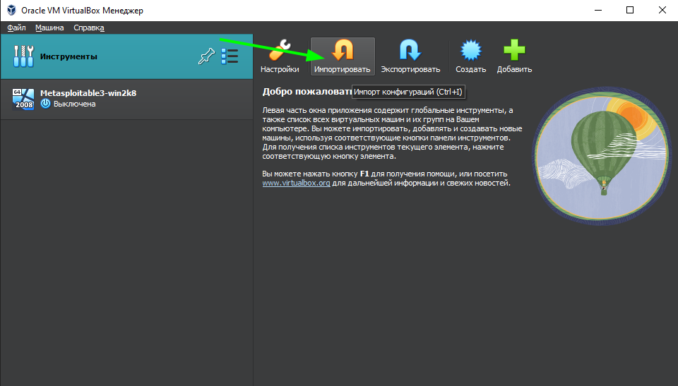
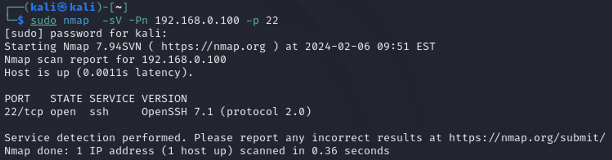

# README

Metasploitable - это виртуальная машина, созданная с нуля с большим количеством уязвимостей в системе безопасности. Она предназначена для использования в качестве мишени для тестирования эксплойтов с помощью [Metasploit](https://www.metasploit.com/).

Данный репозиторий содержит в себе инструкции по эксплуатации уязвимостей, содержащихся внутри машины с помощью фреймворка Metasploit и “вручную” в образовательных целях

“Развернуть” данную машину можно самостоятельно, используя инструкцию на github’e компании rapid7, либо использовать уже готовый образ.

#### Инструкция по установке виртуальной машины с помощью готового образа

Перед установкой вам нужно скачать:

* [VirtualBox](https://www.virtualbox.org/wiki/Downloads)
* Сам образ по этой ссылке (ссылка на ЯД)

После этого откройте VirtualBox выберите Инструменты → Импортировать

<figure><figcaption></figcaption></figure>

Далее выберите .ova файл, скачанный ранее, и нажмите “Далее”:

<figure><figcaption></figcaption></figure>

После этого рекомендую выставить побольше ОЗУ для виртуальной машины:

<figure><figcaption></figcaption></figure>

После завершения импорта будет доступна виртуальная машина Metasploitable на Windows

Перейдите в настройки виртуальной машины → Сеть → Тип подключения и выберите “Сетевой мост” и затем запустите машину

<figure><figcaption></figcaption></figure>

Логин/пароль для входа: vagrant/vagrant

Откройте PowerShell и введите команду `ipconfig` , чтобы узнать частный IP-адрес вашей машины:

<figure><figcaption></figcaption></figure>

Для эксплуатации уязвимостей вам понадобится “атакующая” машина, рекомендую установить [kali linux](https://www.kali.org/get-kali/#kali-platforms)

Приятного хакинга!
