# GlassFish Exploitation

GlassFish - это cервер приложений с открытым исходным кодом, реализующий спецификации Java EE, изначально разработанный Sun Microsystems

<figure>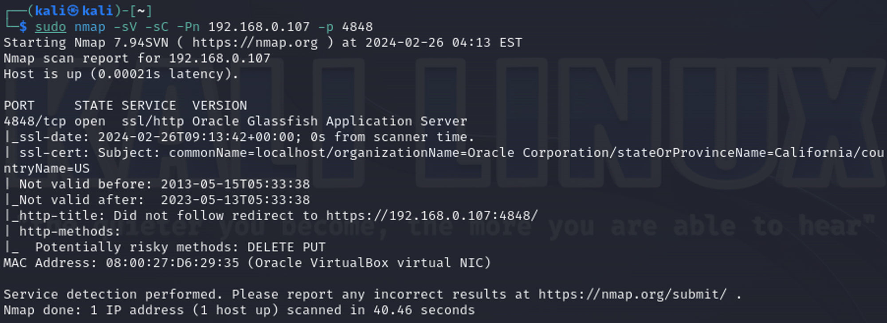<figcaption></figcaption></figure>

По адресу [http://ваш-ip:4848](http://xn---ip-5cdj7k:4848/) будет доступна консоль администратора Glassfish

<figure>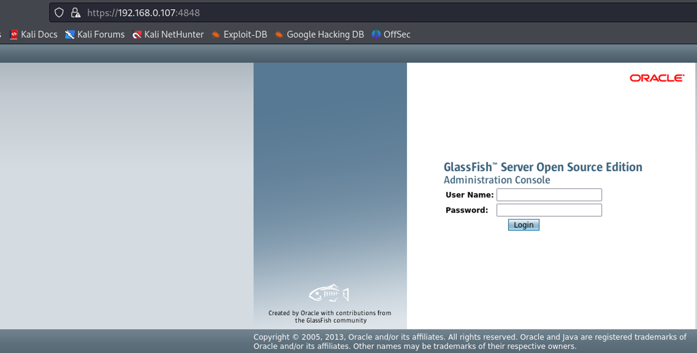<figcaption></figcaption></figure>

#### GlassFish BruteForce

Для подбора учетных данных от консоли администратора GlassFish можно использовать модуль `auxiliary/scanner/http/glassfish_login`

Для ускорения подбора учетных данных используйте данные файлы с [именами пользователей](https://github.com/ZHIRspb/metasploitable_GIS/blob/main/tasks/users.txt)  и [паролями](https://github.com/ZHIRspb/metasploitable_GIS/blob/main/tasks/passwords.txt) 

<figure>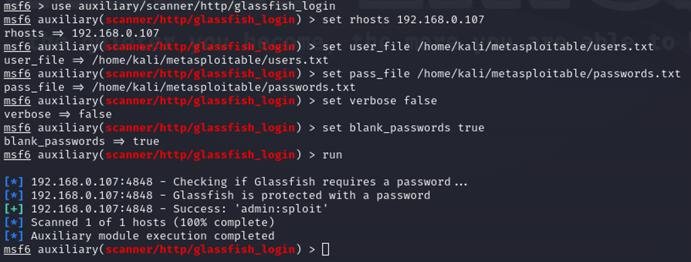<figcaption></figcaption></figure>

#### GlassFish Hash Dump

С помощью модуля `auxiliary/scanner/http/glassfish_traversal` вы можете сдампить хэш пароля от учетной записи админа, который находится в файле **/glassfish/glassfish4/glassfish/domains/domain1/config/admin-keyfile**

<figure>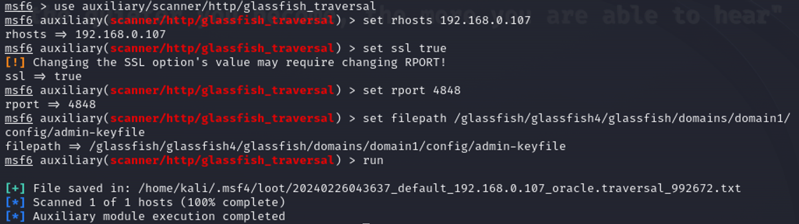<figcaption></figcaption></figure>

<figure>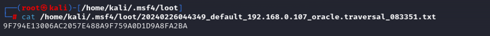<figcaption></figcaption></figure>

#### GlassFish Reverse Shell

Для получения Reverse Shell’a вы можете использовать модуль exploit/multi/glassfish\_deployer

> К сожалению, в моем случае он не сработал, я не смог найти причину&#x20;

<figure>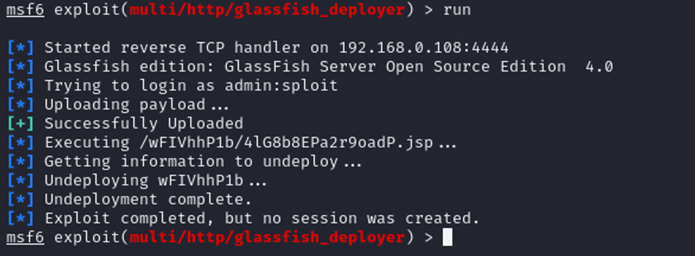<figcaption></figcaption></figure>

Кроме использования модуля Metasploit вы можете получить обратную оболочку “вручную”

Для этого перейдите во вкладку Applications в левой панели Common Tasks и нажмите кнопку Deploy

<figure>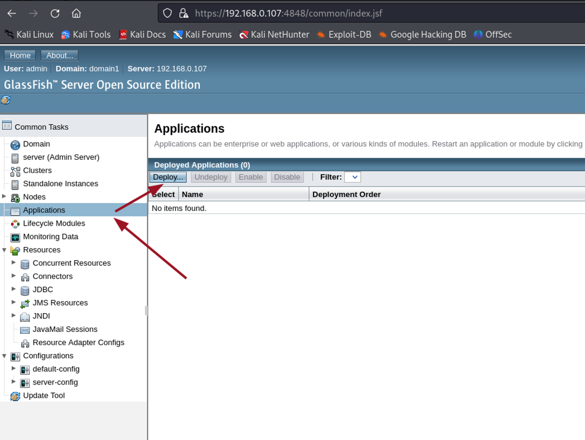<figcaption></figcaption></figure>

Для генерации payload’a вы можете использовать утилиту msfvenom.

Укажите тип полезной нагрузки, удаленный хост и порт, на который вы хотите получить shell

<figure>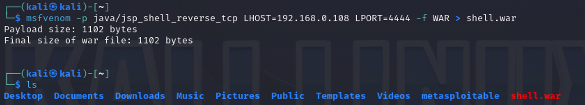<figcaption></figcaption></figure>

Затем выберите созданный файл

<figure>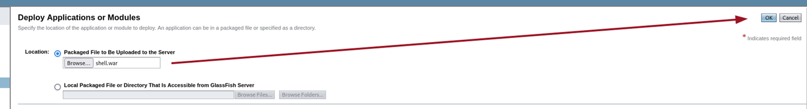<figcaption></figcaption></figure>

И нажмите кнопку Launch

<figure>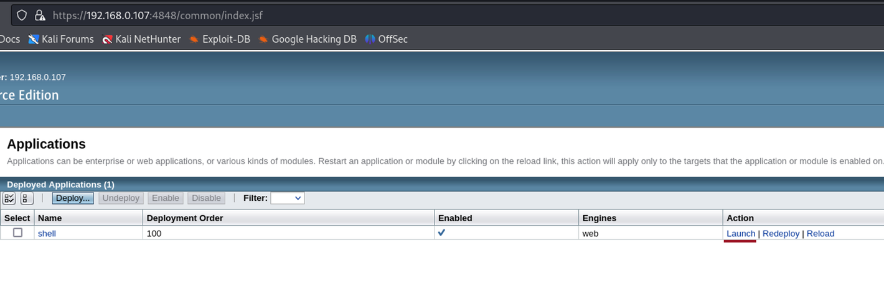<figcaption></figcaption></figure>

После нажатия откроется страница со ссылками, по которым доступен загруженный файл

<figure>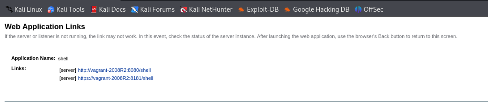<figcaption></figcaption></figure>

Но, перейдя по ним, у вас возникнет ошибка, поэтому нужно заменить имя хоста в ссылке на ip-адрес машины

<figure>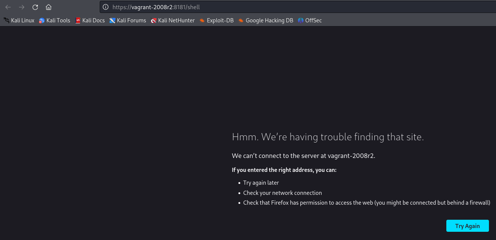<figcaption></figcaption></figure>

Заранее подключив слушатель на выбранный порт “атакующей” машины, обратитесь к загруженному файлу, чтобы получить обратную оболочку машины, на которой развернут GlassFish

<figure>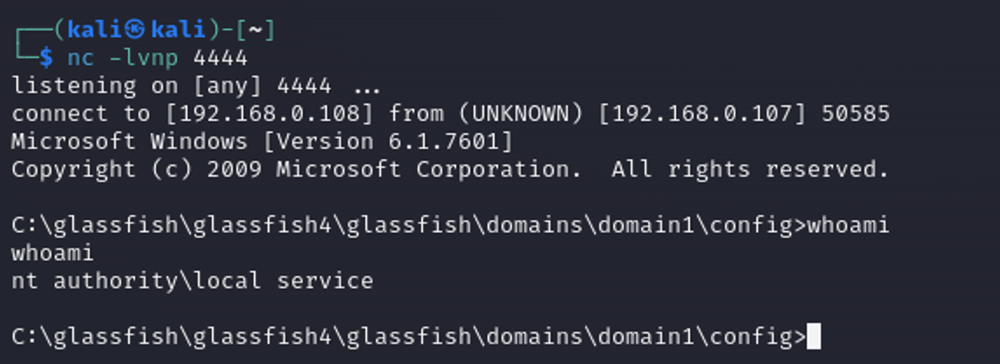<figcaption></figcaption></figure>
