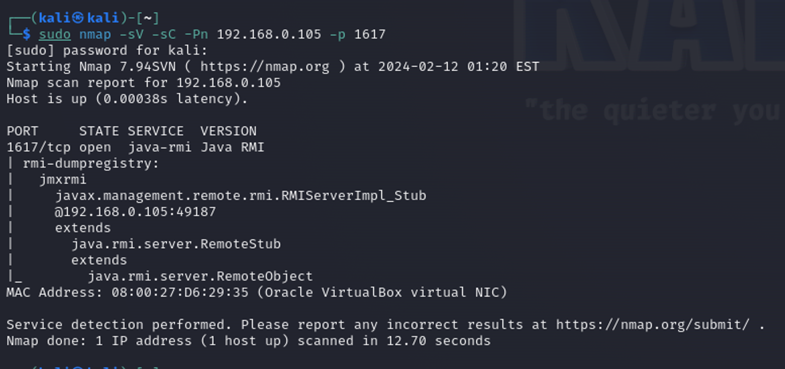
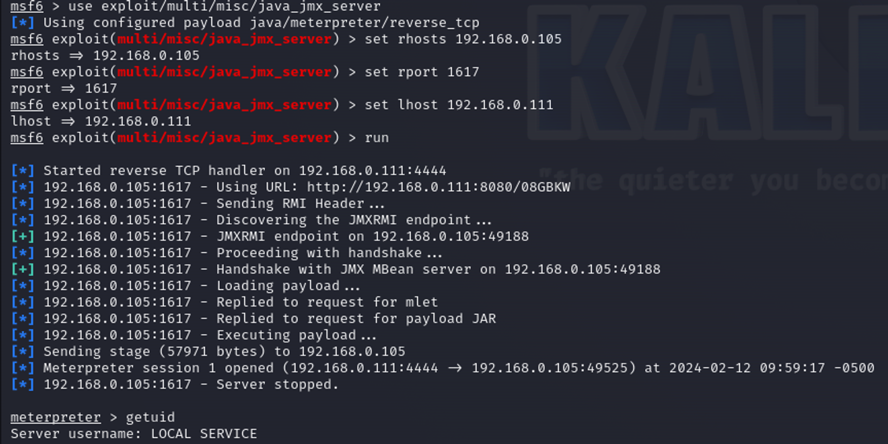
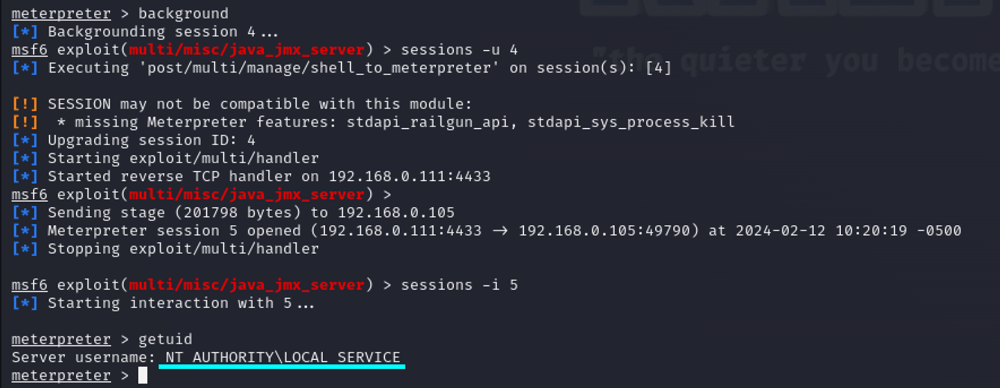

# JMX Exploitation

Java Management Extensions (JMX) — это технология Java, предоставляющая инструменты для управления и мониторинга приложений, системных объектов, устройств (таких как принтеры) и сервис-ориентированных сетей. Эти ресурсы представлены объектами, называемыми MBeans (для Managed Bean).

<figure><figcaption></figcaption></figure>

Служба уязвима к удаленному выполнению кода с помощью протокола RMI

Используя модуль `exploit/multi/misc/java_jmx_server` вы можете получить reverse shell

<figure><figcaption></figcaption></figure>

Открытую сессию можно усовершенствовать, чтобы получить системные привилегии

<figure><figcaption></figcaption></figure>
