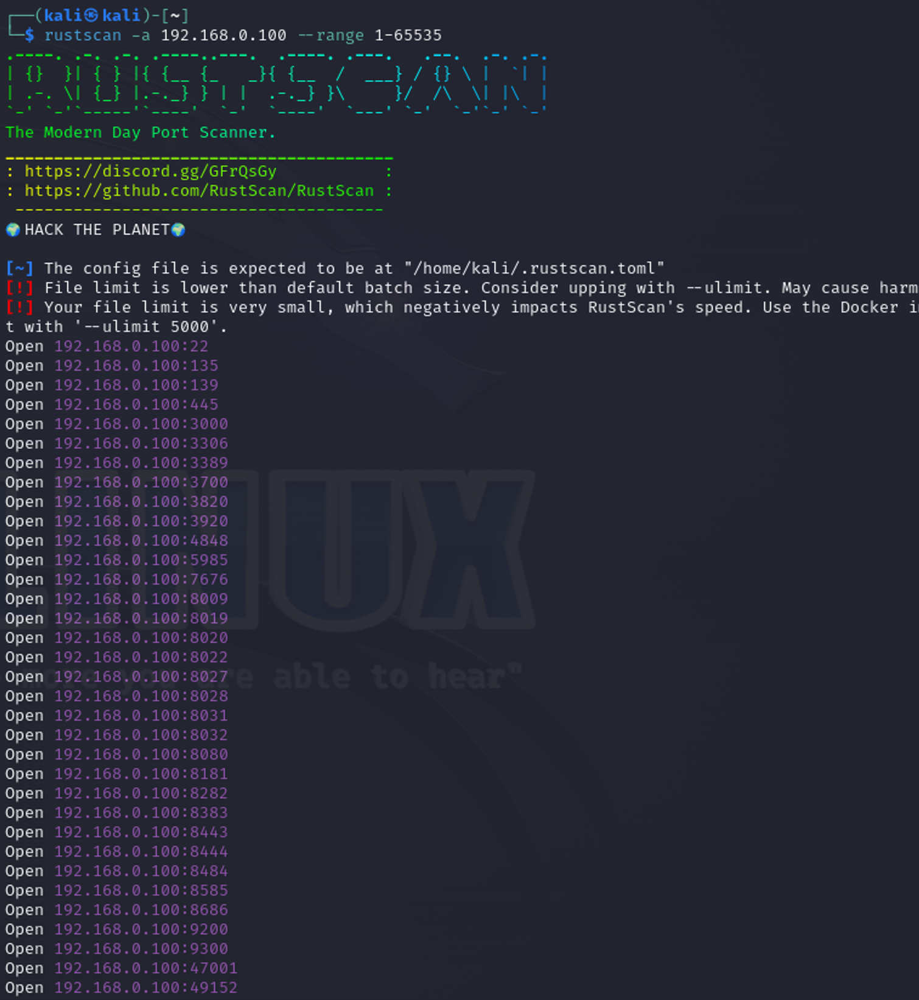
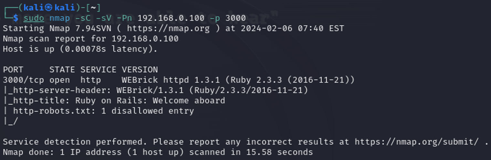
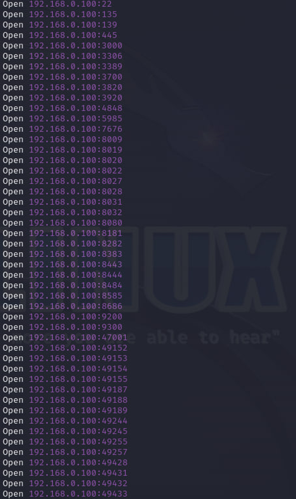

# Port Scanning

Сканирование портов — это удаленное тестирование множества портов с целью определить, в каком состоянии они находятся. Наиболее “интересный” для разведки статус порта - “Открытый”, что означает, что хост прослушивает и принимает соединения через данный порт.

Одной из самых популярных утилит для сканирования портов является [nmap](https://nmap.org/)

Рассмотрим [статусы портов](https://nmap.org/man/ru/man-port-scanning-basics.html) при сканировании с помощью данной утилиты:

* Открыт (open)

Приложение принимает запросы на TCP соединение или UDP пакеты на этот порт. Обнаружение этого состояния обычно является основной целью сканирования. Люди разбирающиеся в безопасности знают, что каждый открытый порт это прямой путь к осуществлению атаки. Атакующие хотят использовать открытые порты, а администраторы пытаются закрыть их или защитить с помощью брадмауэров так, чтобы не мешать работе обычных пользователей. Открытые порты также интересны с точки зрения сканирования, не связанного с безопасностью, т.к. они позволяют определить службы доступные в сети.

* Закрыт (closed)

Закрытый порт доступен (он принимает и отвечает на запросы Nmap), но не используется каким-либо приложением. Они могут быть полезны для установления, что по заданному IP адресу есть работающий хост (определение хостов, ping сканирование), или для определения ОС. Т.к. эти порты достижимы, может быть полезным произвести сканирование позже, т.к. некоторые из них могут открыться. Администраторы могут заблокировать такие порты с помощью брандмауэров.

* Фильтруется (filtered)

Nmap не может определить, открыт ли порт, т.к. фильтрация пакетов не позволяет достичь запросам Nmap этого порта. Фильтрация может осуществляться выделенным брадмауэром, правилами роутера или брандмауэром на целевой машине. Эти порты бесполезны для атакующих, т.к. предоставляют очень мало информации. Иногда они отвечают ICMP сообщениями об ошибке, такими как тип 3 код 13 (destination unreachable: communication administratively prohibited (цель назначения недоступна: связь запрещена администратором)), но чаще встречаются фильтры, которые отбрасывают запросы без предоставления какой-либо информации.

* Не фильтруется (unfiltered)

Это состояние означает, что порт доступен, но Nmap не может определить открыт он или закрыт. Только ACK сканирование, используемое для определения правил брандмауэра, может охарактеризовать порт этим состоянием. Отсутствие ответа также может означать, что фильтр не пропустил запрос или ответ не был получен.

* открыт|фильтруется (open|filtered)

Это состояние используется, когда Nmap не может определить закрыт порт или фильтруется. Используется только при сканировании IP ID idle типа.

Помимо nmap существует огромное количество сканеров, к примеру, [rustscan](https://github.com/RustScan/RustScan), который способен определить открытые порты намного быстрее, чем nmap, но до версии 2.0 у этого инструмента не было функции определения сервисов и их версий.

С помощью rustscan вы можете узнать открытые порты на целевой машине, а затем с помощью nmap и его скриптов определить, что конкретно поднято на этих портах.

<figure><figcaption></figcaption></figure>

<figure><figcaption></figcaption></figure>

У сканера есть свои опции, например, я использовал опции `-sC` `-sV` `-Pn` и `-p`, где:

* `-sC` - сканирование с использованием стандартных NSE скриптов
* `-sV` - определение версии службы, работающей на порту
* `-Pn` - отключение обнаружения хоста (принять хост доступным по умолчанию)
* `-p` - сканирование определенного порта (в данном случае 3000) или диапазона портов (например, 1-10000)

Подробнее о всех опциях можно почитать [здесь](https://nmap.org/book/output-formats-commandline-flags.html) либо в мануале (`man nmap` или `nmap -h`)

Полный список открытых портов на машине Metasploitable:

<figure><figcaption></figcaption></figure>
