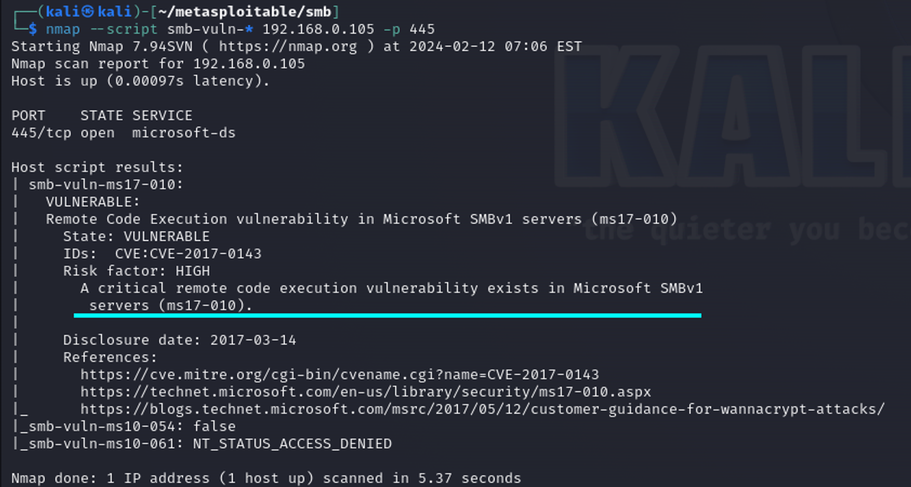

# SMB Exploitation

Этот порт используется для файлами между различными операционными системами, то есть Windows-Windows, Unix-Unix и Unix-windows.

<figure><figcaption></figcaption></figure>

Система работает как сетевой протокол прикладного уровня, который в основном используется для предоставления общего доступа к файлам, принтерам, последовательным портам и другим видам связи между узлами в сети.

### SMB Bruteforce

#### Hydra Bruteforce

В качестве инструмента для перебора учетных данных можно использовать hydra

Для упрощения подбора используйте данные файлы с [юзернеймами](https://github.com/ZHIRspb/metasploitable_GIS/blob/main/tasks/users.txt) и [паролями](https://github.com/ZHIRspb/metasploitable_GIS/blob/main/tasks/passwords.txt) в качестве аргументов

После перебора будут найдены 3 валидные комбинации для доступа к протоколу

<figure><figcaption></figcaption></figure>

#### Metasploit Bruteforce

Для перебора учетных данных для SMB можно использовать модуль `auxiliary/scanner/smb/smb_login`

<figure><figcaption></figcaption></figure>

#### Nmap Bruteforce

Для начала посмотрим, какие есть NSE-скрипты в Nmap, связанные с SMB

<figure><figcaption></figcaption></figure>

Перебор в Nmap можно реализовать с помощью скрипта smb-brute.nse

<figure><figcaption></figcaption></figure>

#### SMB Enumeration

С помощью тех же утилит можно узнать дополнительную информацию об удаленной системе, включая пользователей, общие носители, поддерживаемые версии SMB, идентификаторы безопасности пользователя

Данная информация будет полезна при планировании атаки, а так же может быть использована для реализации атак на другие сервисы.

<figure><figcaption></figcaption></figure>

<figure><figcaption></figcaption></figure>

<figure><figcaption></figcaption></figure>

<figure><figcaption></figcaption></figure>

Вместе с этим мы можем просканировать на наличие уязвимостей, связанный с SMB (и не только)

<figure><figcaption></figcaption></figure>

На машине присутствуют уязвимости класса ms17\_010, следовательно, вы можете попробовать их проэксплуатировать

#### Authenticated PowerShell Command Execution

Для эксплуатации выберите модуль exploit/windows/smb/psexec и присвойте переменной target значение “1”. Этот эксплойт будет использовать действительное имя пользователя и пароль администратора для выполнения PowerShell payload’ов с использованием метода, аналогичного использованию утилиты **psexec**, предоставляемой службой **SysInternals**. Полезная нагрузка кодируется в base64 и выполняется из командной строки с использованием опции –encoded. При использовании этого метода полезная нагрузка никогда не записывается на диск, а поскольку каждая полезная нагрузка уникальна, она менее подвержена обнаружению на основе сигнатур.

<figure><figcaption></figcaption></figure>

После выполнения эксплойта откроется сессия с привилегиями системы

#### Eternal Blue Exploit

Данный эксплойт позволял злоумышленнику получить удаленный доступ к системе и выполнять на ней произвольный код, используя уязвимость SMBv1. Данный эксплойт применялся для распространения шифровальщика WannaCry.

Эксплуатацию уязвимости можно реализовать с помощью модуля `exploit/windows/smb/ms17_010_eternalblue`

<figure><figcaption></figcaption></figure>

#### Double Pulsar Backdoor

Мы можем создать бэкдор на уязвимой машине с помощью Double Pulsar - полезной нагрузки, которая в сочетании с эксплойтом EternalBlue для получения постоянного доступа к взломанным системам и проведения дальнейших атак.

Для того, чтобы развернуть бэкдор, клонируйте [данный](https://github.com/interference-security/Eternalblue-Doublepulsar) репозиторий себе на атакующую машину

```
git clone https://github.com/interference-security/Eternalblue-Doublepulsar
```

<figure><figcaption></figcaption></figure>

Перед использованием скрипты для создания бэкдора выполните команды:

> `dpkg --add-architecture i386`&#x20;
>
> `apt-get update`&#x20;
>
> `apt-get install -y wine32`

Создать бэкдор можно с помощью скрипта [eternablue-exploit.sh](http://eternablue-exploit.sh)

Введите следующую команду:&#x20;

```
externalblue-exploit.sh <TARGET_IP> <TARGET_PORT> <TARGET_OS> <INJECT_TO_PROCESS> <DLL_FILE>
```

<figure><figcaption></figcaption></figure>

Затем используйте Metasploit модуль `exploit/windows/smb/smb_doublepulsar_rce`

В ходе выполнения будет создана сессия с системными привилегиями

<figure><figcaption></figcaption></figure>
