# SNMP Enumeration

SNMP — это стандартный Интернет-протокол для сбора и организации информации об управляемых устройствах в IP-сетях, а также для изменения этой информации для изменения поведения устройства.

Активное сканирование SNMP Enumeration включает в себя запросы к устройствам сети через SNMP с целью получения информации о них, такой как список открытых портов, версия устройства, установленное программное обеспечение и другие данные, которые могут быть использованы для дальнейшего вторжения или эксплуатации уязвимостей.

#### Настройка SNMP

Для настройки службы SNMP нажмите **Start** и перейдите в **Administrative tools → Server Manager**

<figure>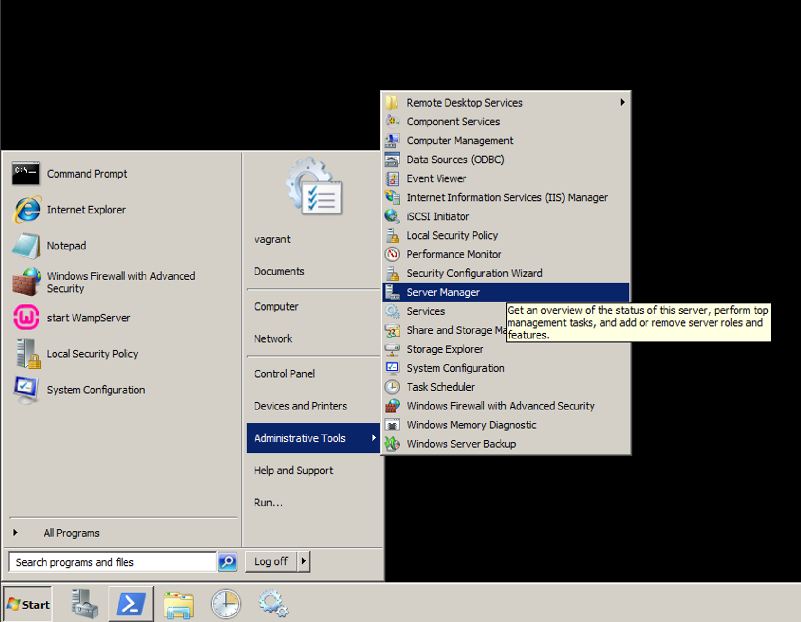<figcaption></figcaption></figure>

Затем выберите **Features** и нажмите на **Add Features**

<figure>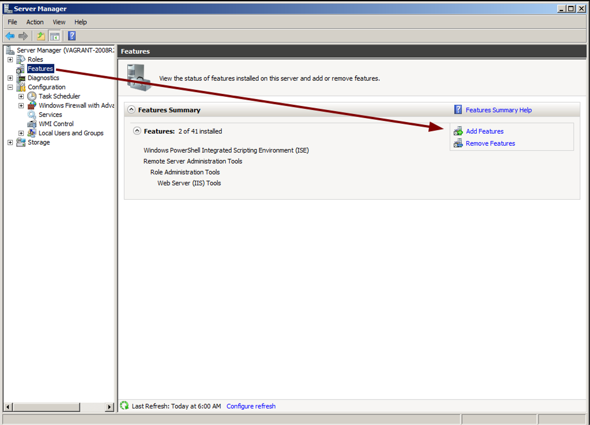<figcaption></figcaption></figure>

Выберите компонент SNMP Services и установите его

<figure>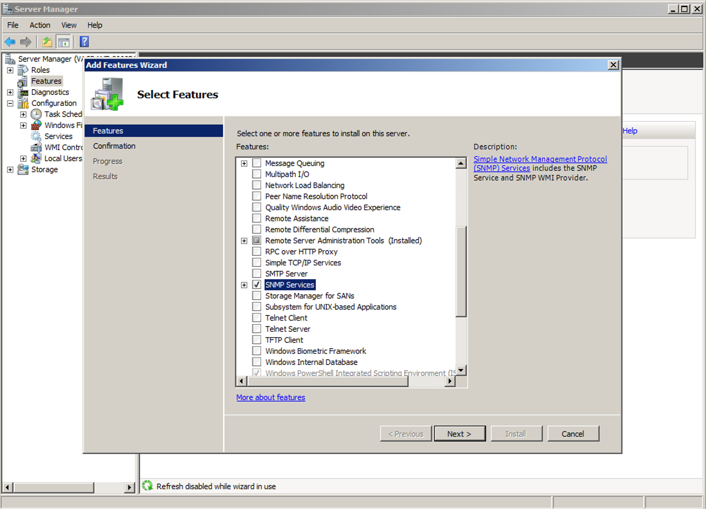<figcaption></figcaption></figure>

После установки сервиса перейдите в Services → SNMP Services → Security и разрешите принятие SNMP-пакетов от любого хоста

<figure>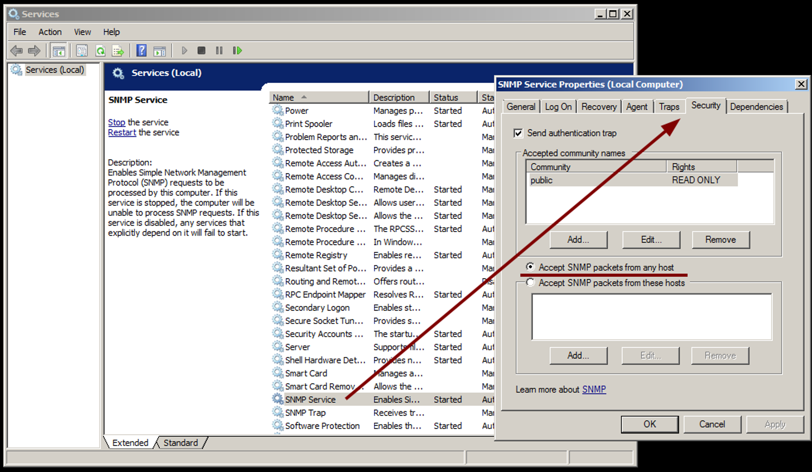<figcaption></figcaption></figure>

После этого на 161 порту развернется служба SNMP

<figure>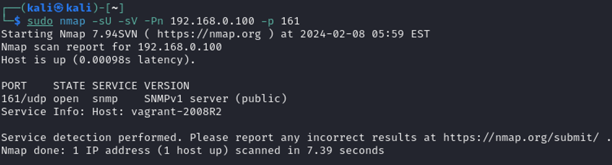<figcaption></figcaption></figure>

#### Metasploit Enumeration

С помощью Metasploit модуля `auxiliary/scanner/snmp/snmp_enumusers` можно узнать, какие пользователи есть на удаленной системе, это может быть полезно, например для подбора пароля к учетной записи

<figure>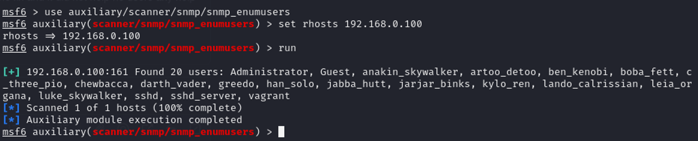<figcaption></figcaption></figure>

Более подробную информацию о хосте можно узнать, используя модуль `auxiliary/scanner/snmp/snmp_enum`

Помимо списка пользователей вы найдете множество полезной информации, такой как:

* Информацию о системе
* Информацию о сети
* Информацию о сетевых интерфейсах хоста
* Информация об открытых портах и запущенных процессах

<figure>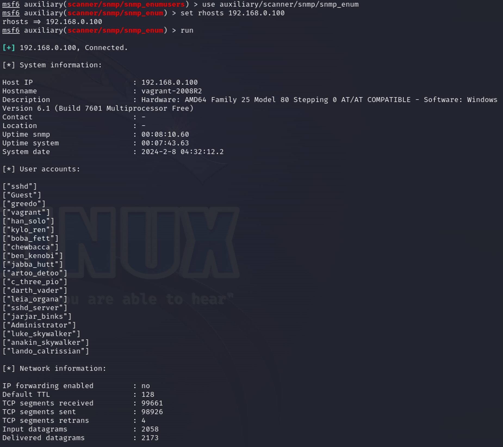<figcaption></figcaption></figure>

<figure>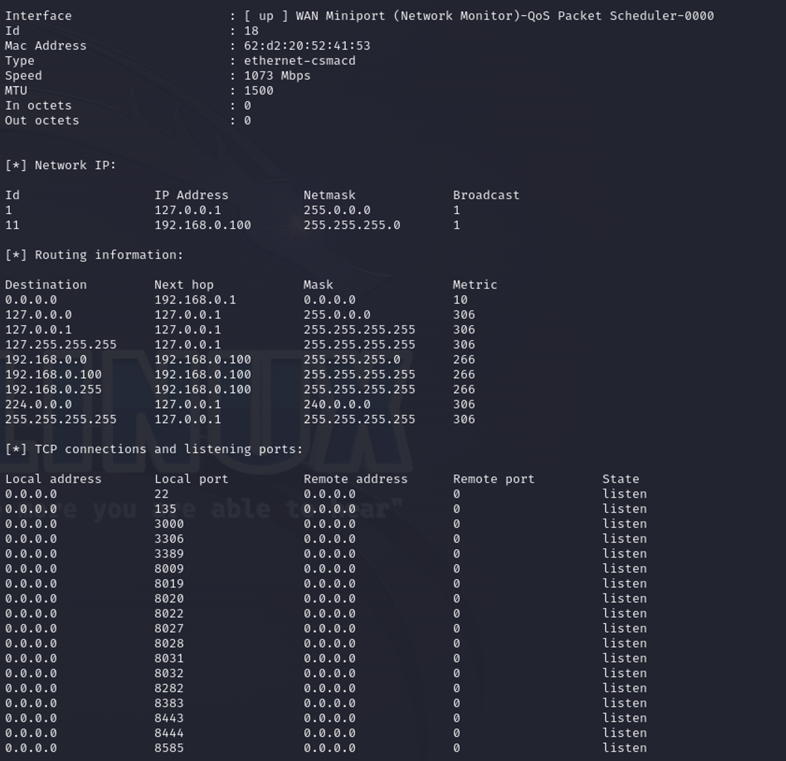<figcaption></figcaption></figure>

<figure>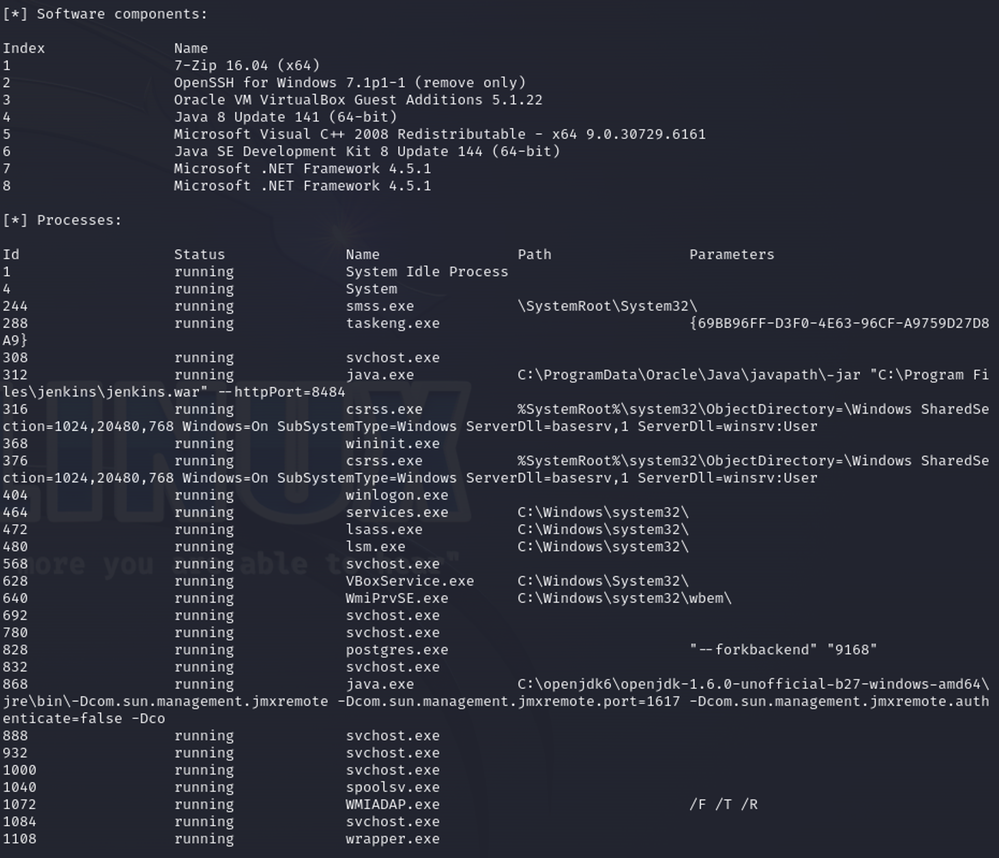<figcaption></figcaption></figure>

Данная информация может быть полезна при нахождении точки входа в систему, поиске уязвимостей и планировании дальнейших действий при атаке на систему

#### SNMPWALK

Для поиска данных в MIB (Managment Information Base) может использоваться утилита **snmpwalk**

Например, выполнив команду `snmpwalk -v1 -c public <ip> iso.3.6.1.2.1.1.5.0` вы можете посмотреть значение объекта **sysName**, который соответствует системному имени устройства по OID ‘iso.3.6.1.2.1.1.5.0’

<figure>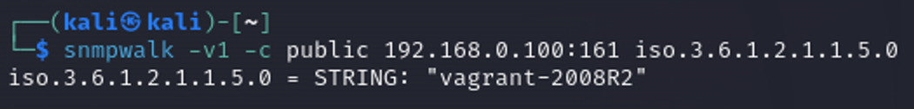<figcaption></figcaption></figure>

Если служба SNMP была настроена с правами «rw», вы можете изменить эти значения с помощью утилиты snmpset

Для настройки прав службы перейдите в **Services → SNMP → Security** и измените права на READ WRITE

<figure>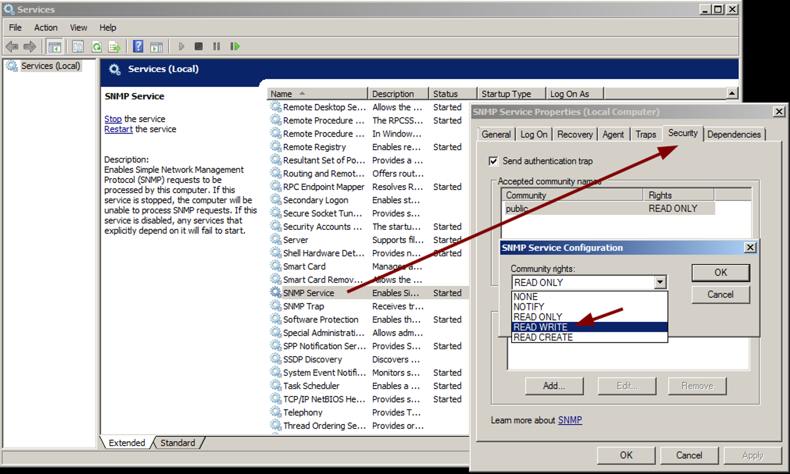<figcaption></figcaption></figure>

После этого с помощью утилиты snmpset вы можете выставить кастомное значение объекту

<figure>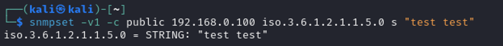<figcaption></figcaption></figure>

Это же значение будет отображаться в переменной

<figure>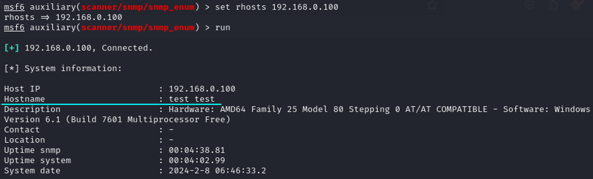<figcaption></figcaption></figure>

Но это изменения касается только SNMP, фактическое имя устройства при этом останется прежним

<figure>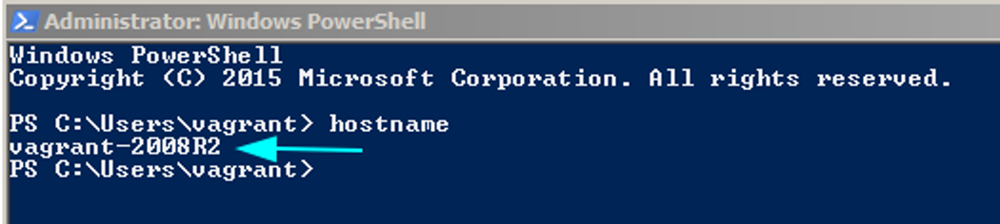<figcaption></figcaption></figure>
