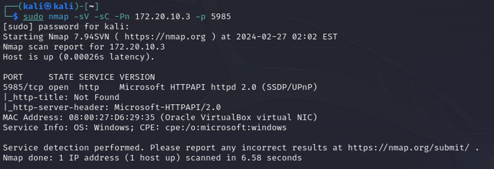
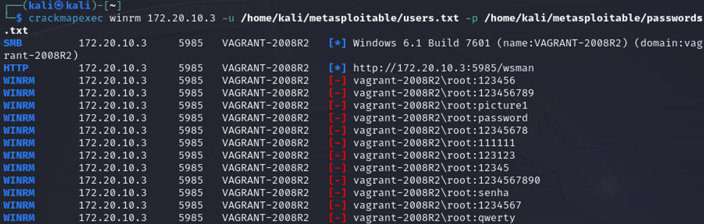
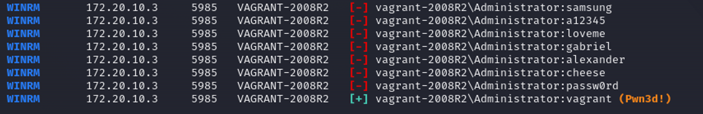
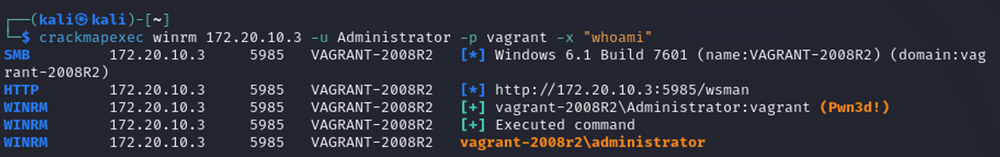
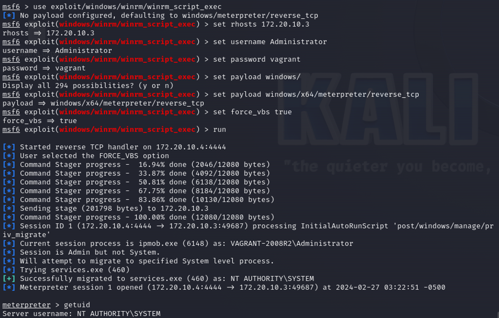

# WinRM Exploitation

Windows Remote Management (WinRM) - это реализация WS-Management Protocol, протокола Simple Object Access Protocol (SOAP), основанного на брандмауэре, который позволяет взаимодействовать оборудованию и операционным системам разных производителей.

<figure><figcaption></figcaption></figure>

#### Crackmapexec WinRM BruteForce

Для подбора учетных данный мы можете использовать утилиту crackmapexec

<figure><figcaption></figcaption></figure>

<figure><figcaption></figcaption></figure>

#### Crackmap WinRM Command Execution

С помощью данной утилиты вы также можете выполнять команды на удаленном хосте, используя валидные учетные данные

<figure><figcaption></figcaption></figure>

#### Metasploit WinRM Exploitation

В Metasploit предусмотрен модуль `exploit/winrm/winrm_script_exec` для получения сессии

<figure><figcaption></figcaption></figure>
